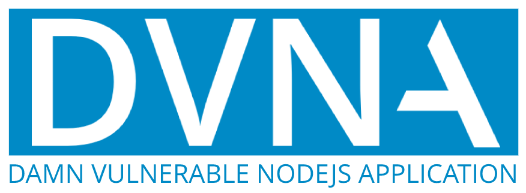

# Damn Vulnerable NodeJS Application (DVNA) 



Damn Vulnerable NodeJS Application (DVNA) is a simple NodeJS application to demonstrate [**OWASP Top 10 Vulnerabilities**](https://www.owasp.org/index.php/Category:OWASP_Top_Ten_Project#OWASP_Top_10_for_2013) and guide on fixing and avoiding these vulnerabilities. The [fixes](https://github.com/appsecco/dvna/tree/fixes) branch will contain fixes for the vulnerabilities.

The application is powered by commonly used libraries such as [express](https://www.npmjs.com/package/express), [passport](https://www.npmjs.com/package/passport), [sequelize](https://www.npmjs.com/package/sequelize), etc.

The application comes with a developer friendly comprehensive guide which can be used to learn, avoid and fix the vulnerabilities. The guide will be made available and will contain the following

1. Instructions for setting up DVNA
2. Instructions on exploiting the vulnerabilities
3. Vulnerable code snippets and instructions on fixing vulnerabilities
4. Recommendations for avoid such vulnerabilities
5. References for learning more

## Quick Start

Setting up the application using docker is the recommended procedure. For detailed instructions and manual setup and please refer to the guide.

Clone this repository
```bash
git clone https://github.com/appsecco/dvna; cd dvna
```

Create a `vars.env` with the desired database configuration
```
MYSQL_USER=dvna
MYSQL_DATABASE=dvna
MYSQL_PASSWORD=passw0rd
MYSQL_RANDOM_ROOT_PASSWORD=yes
```

Start the application and database using docker-compose
```bash
docker-compose up
```

Access the application at http://127.0.0.1:9090/ 

The application will automatically reload on code changes, so feel free to patch and play around with the application.

## TODO

- Add CONTRIBUTING.md
- Link commits to fixes in documentation
- Add new vulnerabilities from OWASP Top 10 2017
- Improve application features, documentation

## Thanks
[Abhisek Datta - abhisek](https://github.com/abhisek) for application architecture and front-end code

## License

MIT
